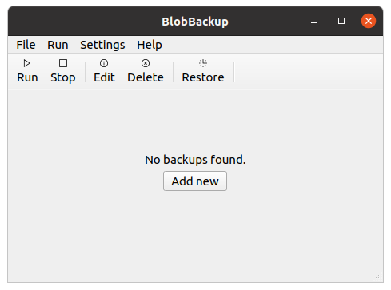
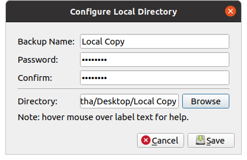
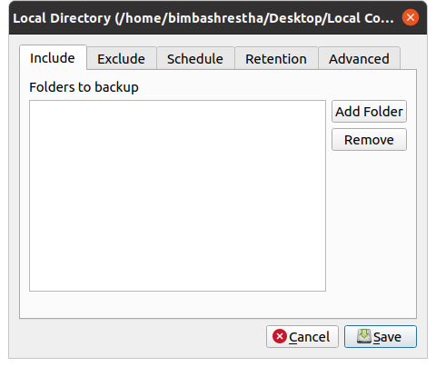
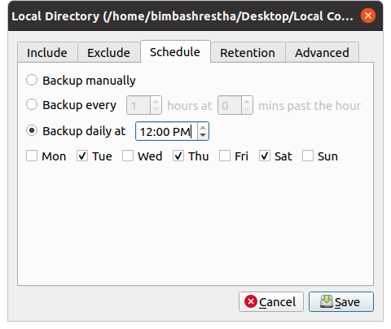
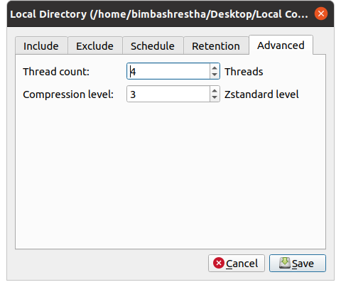

# Backup

Creating a backup requires two things: 1) configuring your storage
and 2) configuring your backup parameters. You can also "connect"
to already configured backup storages when you do a restore.

## Configuring your Storage

The first step is to configure your storage. If you're using BlobBackup
for the first time, you'll see a window like this. Click on "Add New."
If you are using BlobBackup and you already have a Backup configured, 
you can find the "Add New" button under the "File" menu.



From the dialog box that opens, select the storage that you'd like to
configure. Specific instructions for each storage provider are in 
their respective sections below. In the configuration window for each 
storage, you can hover over the field names for a brief description 
of what the field means.

## Local Directory



* Backup Name: Something informative to help you remember your backup 
by.
* Password: The password that is used to encrypt all your data. Keep 
this somewhere safe like a password manager or a secure notebook. If you
lose this password, your data is gone! 
* Local Directory: The directory where you'd like your data to be backed
up. 

### Mounted Storage

Network storage like a NAS or another computer will have to be accessible
in your file system for BlobBackup to write to them. mounting your 
external storage on your file system is a good way to do this.

```
Note: All the storage are supported. Documentation for them is coming 
soon:)
```

## Amazon AWS S3
## Google Cloud Storage
## Microsoft Azure Blob
## Backblaze B2
## Generic S3 Compatible Storage
## SFTP 

## Configuring your Backup Parameters

The backup configuration window has 5 tabs: Include, Exclude, Schedule, 
Retention and Advanced.



In the include tab, you can select which folders you want included in 
your backup. Choose a folder by clicking on the "Add Folder" button.


In the exclude tab, you can specify glob file rules for which paths get 
excluded. For example, if you wanted to exclude everything in your desktop,
you would add an exclude rule like `/home/bimbashrestha/Desktop*`.



In the schedule tab, you can set what schedule BlobBackup should run your 
backups on. You can pick from Manual, hourly, daily or weekly schedules.
Or you can set backups to go off on specific days of the week.


In the retention tab, you can set the number of days you want backups to 
be preserved for. The default option is to keep backups forever.



In the advanced tab, you can configure:

* Thread count: which determines the number of threads used to upload 
your data to your storage. Increasing this will increase speeds up to 
a point.
* Compression level: Higher compression ratios mean smaller files at 
the cost of speed. The compression algorithm used is 
[Zstandard](https://github.com/facebook/zstd) and the levels map 
directly to their levels.


