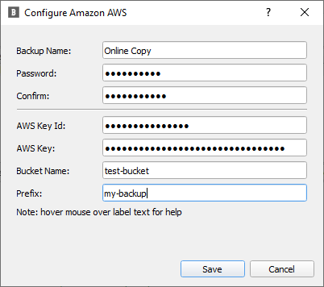
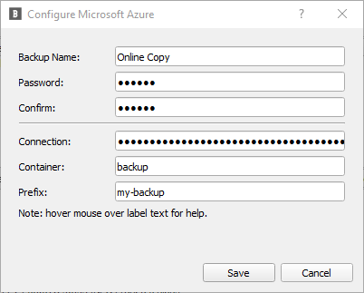
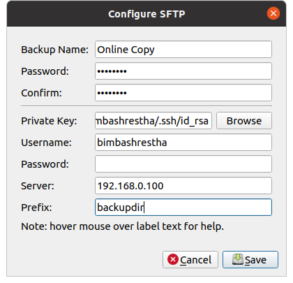
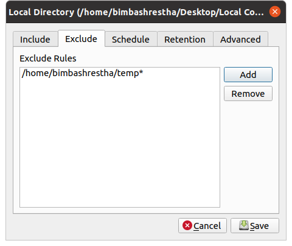
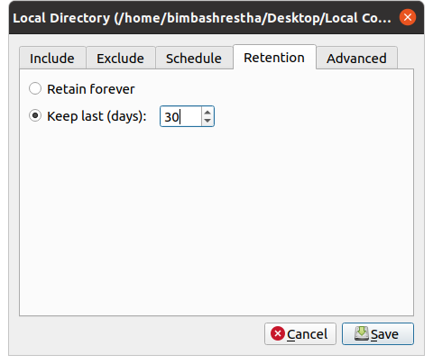

# Backup

Creating a backup requires two things: 1) configuring your storage
and 2) configuring your backup parameters. You can also "connect"
to already configured backup storages when you do a restore.

## Configuring your Storage

The first step is to configure your storage. If you're using BlobBackup
for the first time, you'll see a window like this. Click on "Add New."
If you are using BlobBackup and you already have a Backup configured, 
you can find the "Add New" button under the "File" menu.


From the dialog box that opens, select the storage that you'd like to
configure. Specific instructions for each storage provider are in 
their respective sections below. In the configuration window for each 
storage, you can hover over the field names for a brief description 
of what the field means.

## Local Directory


* Backup Name: Something informative to help you remember your backup 
by.
* Password: The password that is used to encrypt all your data. Keep 
this somewhere safe like a password manager or a secure notebook. If you
lose this password, your data is gone! 
* Local Directory: The directory where you'd like your data to be backed
up. 

### Mounted Storage

Network storage like a NAS or another computer will have to be accessible
in your file system for BlobBackup to write to them. Mounting your 
external storage on your file system is a good way to do this.

```
Note: All the storage are supported. Documentation for them is coming 
soon:)
```

## Amazon AWS S3



* Backup Name: Something informative to help you remember your backup 
by.
* Password: The password that is used to encrypt all your data. Keep 
this somewhere safe like a password manager or a secure notebook. If you
lose this password, your data is gone! 
* AWS Key Id: The AWS Access Key Id for your bucket.
* AWS Key: The AWS Secret Access Key for your bucket.
* Bucket name: The name of the S3 Bucket that you would like your backups 
to go to. It must already exist. BlobBackup will not create buckets for you.
* Prefix: The path that will be added before every object that BlobBackup 
uploads. This is required.
If you are creating multiple backups to the same bucket, just set this 
field to something unique for each backup.

## Google Cloud Storage


* Backup Name: Something informative to help you remember your backup 
by.
* Password: The password that is used to encrypt all your data. Keep 
this somewhere safe like a password manager or a secure notebook. If you
lose this password, your data is gone! 
* Credentials: The Service Account json file with read/write access to your 
bucket. Can be downloaded from the Google Cloud Console.
* Project Id: The project Id or name that contains your bucket. Can be found in 
the Google Cloud Console.
* Bucket Name: The name of your Google Cloud Storage bucket. It must already 
exist. BlobBackup will not create buckets for you.
* Prefix: The path that will be added before every object that BlobBackup uploads.

## Microsoft Azure Blob



* Backup Name: Something informative to help you remember your backup 
by.
* Password: The password that is used to encrypt all your data. Keep 
this somewhere safe like a password manager or a secure notebook. If you
lose this password, your data is gone! 
* Connection: The connection string for your container. This can be found in the 
Azure web portal.
* Container: The name of your storage container on Azure. It must already exist. 
BlobBackup will not create containers for you.
* Prefix: The path that will be added before every object that BlobBackup uploads.

## Backblaze B2

You can use BlobBackup to create backups to Backblaze B2 buckets. 
Before you configure BlobBackup with B2, you will have to create your 
bucket first. You can do this from the B2 web portal.

Note: Make sure to set the lifecycle settings for B2 to "keep only
the last version". BlobBackup will handle versioning for you so 
this is unnecessary.


* Backup Name: Something informative to help you remember your backup 
by.
* Password: The password that is used to encrypt all your data. Keep 
this somewhere safe like a password manager or a secure notebook. If you
lose this password, your data is gone! 
* B2 key Id: Your B2 master key id or application key id.
* B2 app key: You B2 master key or application key.
* Bucket name: The name of your bucket on B2.
* Prefix: The path inside your bucket where backups will go. This is required.
If you are creating multiple backups to the same bucket, just set this 
field to something unique for each backup.

## Generic S3 Compatible Storage


* Backup Name: Something informative to help you remember your backup 
by.
* Password: The password that is used to encrypt all your data. Keep 
this somewhere safe like a password manager or a secure notebook. If you
lose this password, your data is gone! 
* S3 URL: The endpoint URL of the S3 compatible storage.
* Key Id: Your S3 compatible storage Access Key Id.
* Key: S3 compatible storage Secret Access Key.
* Bucket name: Your S3 compatible storage bucket. It must already exist. 
BlobBackup will not create buckets for you.
* Prefix: The path that will be added before every object that BlobBackup 
uploads. This is required.
If you are creating multiple backups to the same bucket, just set this 
field to something unique for each backup.

## SFTP



* Backup name: Something informative to help you remember your backup 
by.
* Password: The password that is used to encrypt all your data. Keep 
this somewhere safe like a password manager or a secure notebook. If you
lose this password, your data is gone! 
* Private key: The path to your private RSA key. If you leave this blank,
BlobBackup will try to use your user's default ssh private key located at 
~/.ssh/id_rsa
* Password: The password (if you're using password based login) for your 
server. If this is left blank, BlobBackup will assume ssh key based 
authentication.
* Server: The url of your server.
* Prefix: The full path inside your server where you want your backups to
go. This folder must already be created ahead of time.

## Configuring your Backup Parameters

The backup configuration window has 5 tabs: Include, Exclude, Schedule, 
Retention and Advanced.


In the include tab, you can select which folders you want included in 
your backup. Choose a folder by clicking on the "Add Folder" button.



In the exclude tab, you can specify glob file rules for which paths get 
excluded. For example, if you wanted to exclude everything in your desktop,
you would add an exclude rule like `/home/bimbashrestha/Desktop*`.


In the schedule tab, you can set what schedule BlobBackup should run your 
backups on. You can pick from Manual, hourly, daily or weekly schedules.
Or you can set backups to go off on specific days of the week.



In the retention tab, you can set the number of days you want backups to 
be preserved for. The default option is to keep backups forever.


In the advanced tab, you can configure:

* Thread count: which determines the number of threads used to upload 
your data to your storage. Increasing this will increase speeds up to 
a point.
* Compression level: Higher compression ratios mean smaller files at 
the cost of speed. The compression algorithm used is 
[Zstandard](https://github.com/facebook/zstd) and the levels map 
directly to their levels.


